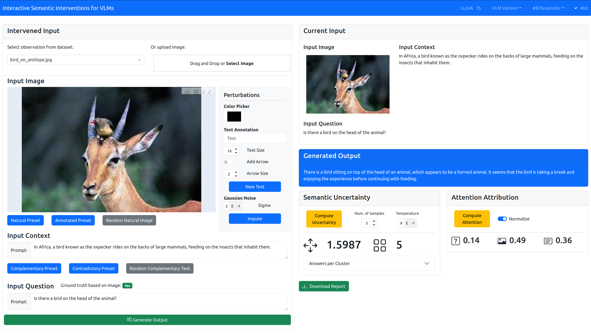

<br />
<p align="center">
  <a href=" ">
     
  </a>

  <h1 align="center">ISI: Interactive Semantic Interventions for VLMs <br> <i>(REVIEWER VERSION)</i></h1>

  <p align="center">


  </p>
</p>

ISI empowers researchers and end-users to gain deeper insights into VLM behavior, enabling more effective troubleshooting and refinement of these models.

> Abstract: <br>*Vision Language Models (VLMs), like ChatGPT-o and LLaVA, exhibit exceptional versatility across a wide array tasks due to their adaptable, language-based interface for input and output generation. However, our understanding of how VLMs integrate information from different modalities and especially how contradictory or complementary data affects their answer and reasoning generation is limited, leading to potential undetected hallucinations. These challenges undermine VLMs’ accuracy and reliability, as well as their development for effective integration of multipe data sources and modalities. Subsequently, we introduce Interactive Semantic Interventions (ISI), a tool designed to help researchers and users of VLMs understand how these models respond to interventions and semantic changes in both image and text modalities, specifically within the context of Visual Question Answering (VQA). Specifically, it offers an interface and pipeline for semantically meaningful interventions on both image and text, while quantitatively evaluating the generated output in terms of modality importance and model uncertainty. Alongside the tool we publish a specifically tailored VQA dataset including predefined presets for semantic meaningful interventions on image and text modalities. ISI empowers researchers and users to gain deeper insights and intuitions into VLM behavior, enabling more effective troubleshooting and a well evaluated basis setting for large scale VLM experiments.*


## 📝&nbsp;&nbsp;Citing this Work

If you use ISI please cite our [paper]()

```bibtex
@inproceedings{}
```

## 🧭&nbsp;&nbsp;Table of Contents
* [Installation](#Installation)
* [ISI VQA dataset](#isi-vqa-dataset)
* [Getting started](#getting-started)
  * [Using the ISI VQA dataset](#using-the-isi-vqa-dataset)
  * [Using custom data](#using-custom-data)
  * [Using custom VLMs](#using-custom-vlms)   
* [Acknowledgements](#acknowledgements)

## ⚙️&nbsp;&nbsp;Installation

ISI requires Python version 3.10 or later. All essential libraries for running the tool are installed when installing this repository:

```bash
conda create -n isi-vlm python=3.10
conda activate isi-vlm
pip install torch==2.3.0 torchvision==0.18.0 torchaudio==2.3.0 —index-url https://download.pytorch.org/whl/cu118
git clone https://github.com/link/to/repository
cd isi-vlm
pip install .
```
Testing and development was done on CUDA 11.6. In theory the tool also runs on CPU only (please adapt pip install torch), but computations take significantly longer. We recommend at least 24GB VRAM (e.g. RTX 3090). 

## 🚀&nbsp;&nbsp;Getting started 
### 🏞️&nbsp;Using the ISI VQA dataset

The dataset is automatically downloaded with the repository and is located in `dash_app/assets/`. In the tool, observations can be selected with the left dropdown menu. 

### 🧪&nbsp;Using custom data

There are two ways to use ISI with your own images and questions:

#### 1. Simple Method: Drag and Drop

For single image evaluation, the easiest approach is to drag and drop your image into the respective field within the tool. You can then manually fill out the accompanying text field. This method is recommended if you are evaluating just one image.

#### 2. Advanced Method: Batch Evaluation

If you want to evaluate a set of images, follow these steps:

1. Copy your images into the appropriate folders:
   - `dash_app/assets/natural_images`
   - `dash_app/assets/annotated_images`
   
2. Add the image file names and corresponding text inputs to the `dash_app/assets/vlm_dataset.csv` file.

**Note:** You don't need to fill out all the columns in the CSV file. However, if some fields are left empty, the corresponding presets will not be usable.

--- 

This formatting ensures clarity and ease of use for anyone referencing your repository.

### 🤖&nbsp;Using custom VLMs

It is possible to use other Vision-Language Models (VLMs) from the [Hugging Face library](https://huggingface.co/blog/vlms). However, several adaptations must be made to the code:

#### Required Code Modifications

1. **`dash_app/app.py`:**
   - Add the model name to the `update_llava_version` function to make it selectable from the drop-down menu.

2. **`dash_app/run_llava.py`, `dash_app/compute_attention.py`, and `dash_app/compute_uncertainty.py`:**
   - Add the model to the model selection by defining the `processor` and `model` variables.
   - If your VLM uses a specific chat template, add it to the template selection below the model selection.

3. **`dash_app/compute_attention.py`:**
   - If your VLM does not use token fusing and input methods similar to LLaVA 1.5 or LLaVA-NeXT, you will need to adapt the attention computation. This may include adding hooks to the `_merge_input_ids_with_image_features` method of your transformer VLM object to get the start and end positions of each input token groups.


## 🏞️&nbsp;&nbsp;ISI VQA dataset

The ISI VQA dataset is a closed-question VQA dataset consisting of 100 observations. Each observation consists of an image (`dash_app/assets/natural_images`), question, and ground truth answer (Yes/No) pair, as well as one text annotated image (`dash_app/assets/annotated_images`), one contradictory context, and one complementary context (`dash_app/assets/vlm_dataset.csv`). The context is always in relation to the ground truth answer, aiming to either confuse or help the model without stating an explicit answer to the question, as each question can only be answered through the image. Thus, the model has a very limited ability to leverage prior knowledge to answer the question and must utilize the image input, as prior research indicates a significant bias towards text in VLMs. The annotation on the image gives text-written hints to the ground truth answer. The images are open-source and from the [MMMU Benchmark](https://mmmu-benchmark.github.io/). All other modalities are carefully crafted for the dataset, focusing on quality not quantity.


## 📣&nbsp;&nbsp;Acknowledgements

The code is developed by the authors of the tool. However, it does also contain pieces of code from the following packages and repositories:

- transformers by Hugging Face: https://github.com/huggingface/transformers
- attention by Matt Neary: https://github.com/mattneary/attention
- semantic_uncertainty by Jannik Kossen: https://github.com/jlko/semantic_uncertainty 

The tool is developed in [Dash](https://github.com/plotly/dash) for Python.
